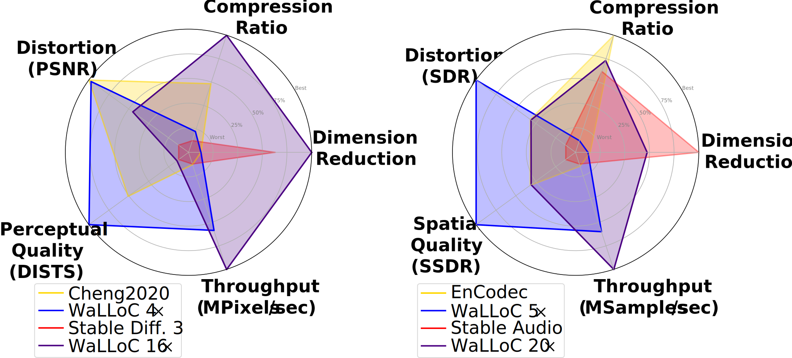

# Wavelet Learned Lossy Compression

- [WaLLoC repository](https://github.com/danjacobellis/walloc/)
- [Paper: "Learned Compression for Compressed Learning"](https://danjacobellis.net/_static/walloc.pdf)
- [Additional code accompanying the paper](https://github.com/danjacobellis/lccl)
- [Pre-trained codecs available on Hugging Face](https://huggingface.co/danjacobellis/walloc)

